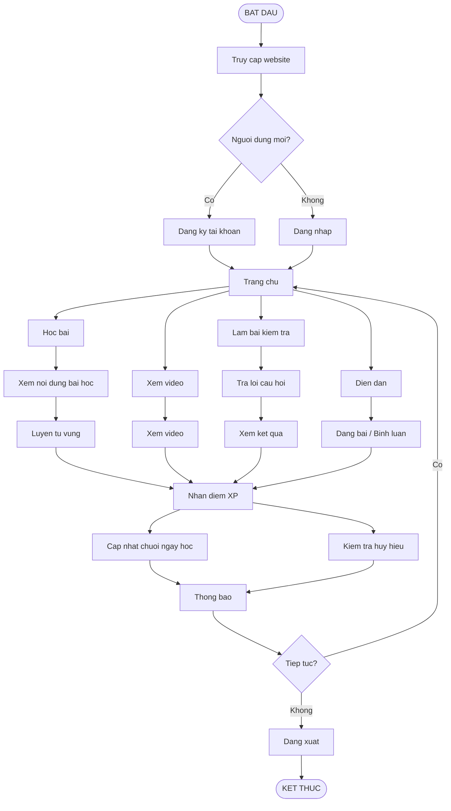
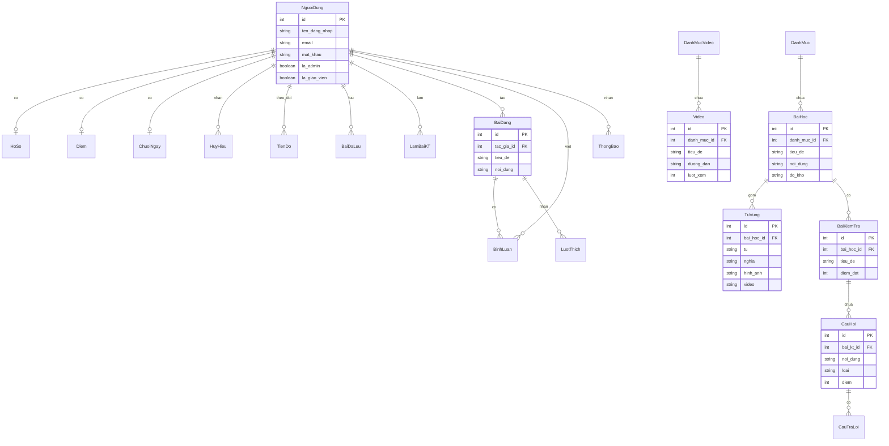

# Signox - So Do Hoat Dong

## So Do Co So Du Lieu

## Vai Tro Nguoi Dung

| Vai Tro | Quyen Truy Cap |
|---------|----------------|
| **Admin** | `/admin/` + `/manage/` |
| **Giao vien** | `/manage/` |
| **Nguoi dung** | Hoc tap |
